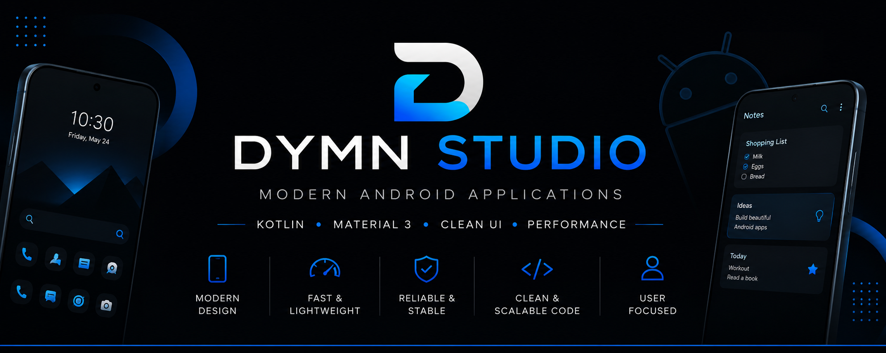

  

## 👋 Welcome

Building modern Android applications with a focus on clean UI, performance and practical user experience.
---

## 🚀 Featured Projects

### 📱 Dymn Launcher

Minimal iOS-inspired Android launcher focused on speed, simplicity and personal customization.

[📂 Repository](https://github.com/DymnStudio/Dymn-Launcher)

---

### 📝 Dymn Notes

Simple and lightweight notes app with a clean interface.

[📂 Repository](https://github.com/DymnStudio/Dymn-Notes)

---

### 👶 Dymn Baby

Baby activity tracker for feeding, sleep, diapers and daily routines.

[📂 Repository](https://github.com/DymnStudio/Dymn-Baby)

---

### 🚇 Dymn METRO

Metro-style Android launcher with a modern interface and iOS-inspired settings.

[📂 Repository](https://github.com/DymnStudio/Dymn-METRO)

---

## 🎯 Expertise

- Android Application Development
- Kotlin & Jetpack
- Material Design 3
- Launcher Experiences
- Clean UI / UX
- Performance Optimization

---

**Building Android apps that people enjoy using.**

## 💼 Currently Building

- 📱 Android applications
- 🚀 Open source projects
- 🎨 Modern Material Design interfaces
- 💡 New ideas for Dymn Studio
